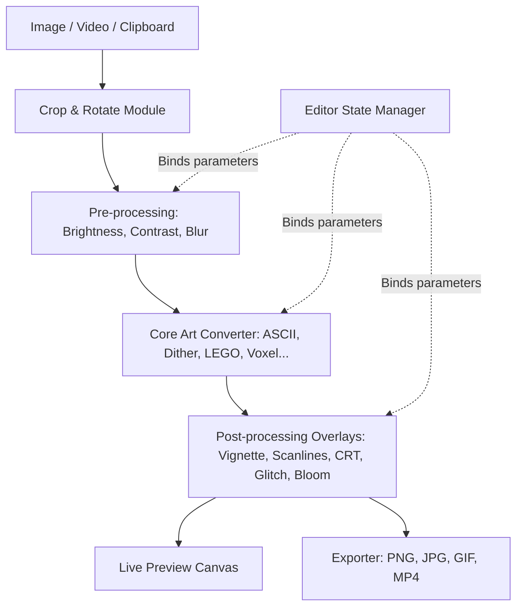

# Design Document - Image to ASCII / ASCII Magic Clone

## Overview

This document outlines the technical design for a complete, production-grade clone of [ASCII Magic](https://www.ascii-magic.com/). It provides a fully functional client-side web application consisting of two primary interfaces:
1. **Landing Page (`index.html`)**: A premium dark-themed promotional page featuring an interactive before/after comparison slider, community showcases, post-processing toggle demonstrations, and FAQs.
2. **Editor Page (`app/index.html`)**: A full-featured workspace with source ingest, cropping, recipe sharing, real-time Canvas/WebGL stylizers (for 15 distinct styles), intensity settings, background controls, color adjustment, blurs, and stacked post-processing filters.

## Steering Document Alignment

### Technical Standards (tech.md)
The application will be built using vanilla HTML5, CSS3, and modern ES6+ Javascript. It will leverage Tailwind CSS (via CDN) for responsive utility-first layouts, ensuring visual fidelity. All computations will be performed client-side on the CPU (Canvas 2D) and GPU (WebGL) to achieve zero latency and absolute user privacy.

### Project Structure (structure.md)
The codebase is structured flatly to align with static deployment expectations:
- `/index.html`: Landing page.
- `/app/index.html`: Editor page.
- `/docs/superpowers/specs/`: Specifications.
- `/.spec-workflow/`: Spec-driven workflow tracking.

## Code Reuse Analysis

### Existing Components to Leverage
- **`/index.html` (Existing landing mockup)**: The typography, Satoshi/Pixelify Sans loading, and Tailwind configuration in the current `/index.html` will be preserved, refactored, and expanded to match the exact look-and-feel of the target site.

### Integration Points
- **HTML5 Canvas API**: Used for all image scaling, pixel retrieval, rendering of block/LEGO/voxel shapes, character grids, and color manipulation.
- **HTML5 Video API**: Used to capture frame sequences from uploaded videos in real-time, feeding them through the rendering engine.
- **URL Serialization**: Used to compile the editor state (all adjustments) into a query string for easy recipe sharing.

## Architecture

The application adopts a modular client-side pipeline architecture. The UI is built around a single reactive state model, while the graphics processor executes frame rendering dynamically.



### Modular Design Principles
- **Separation of Pipeline**: The processing pipeline (Source -> Crop -> Preprocess -> Render -> Postprocess) is isolated from UI event handlers.
- **Component Styling**: Styled using consistent HSL color schemes (`#040406` bg, custom orange accent `#FF8A3C`) and pixel borders, matching the target website's high-tech terminal theme.
- **Pure JavaScript Rendering**: All conversion code is optimized to run in-memory, avoiding library overhead (like WebGL wrappers) to keep the file size minimal.

## Components and Interfaces

### UI Controller (`app.js`)
- **Purpose**: Binds the sidebar form elements (inputs, select boxes, checkboxes) to the editor state, managing collapsable panels, dialogs (crop/rotate overlay), and video playback controls.
- **Interfaces**:
  - `updateState(key, value)`: Updates the current parameter and triggers a redraw.
  - `loadMedia(file)`: Identifies if file is image or video and setups HTMLMediaElements.
- **Dependencies**: None.

### Core Processing Engine (`processor.js`)
- **Purpose**: Performs the pixel manipulation and draws stylized grids.
- **Interfaces**:
  - `processFrame(sourceCanvas, targetCanvas, options)`: The main loop.
- **Core Conversion Functions**:
  - `renderASCII(ctx, imgData, width, height, options)`: Standard character ramp rendering.
  - `renderDither(ctx, imgData, width, height, options)`: Error diffusion (Floyd-Steinberg/Atkinson) and ordered dithering.
  - `renderLEGO(ctx, imgData, width, height, options)`: Quantitative circles with highlight overlays.
  - `renderVoxel(ctx, imgData, width, height, options)`: Draws isometric blocks with light sources.
  - `renderDots(ctx, imgData, width, height, options)`: Halftone print effect.
  - `renderBlockChars(ctx, imgData, width, height, options)`: Unicode block mapping.

### Post-Processing Engine (`postprocess.js`)
- **Purpose**: Applies stacked visual effects to the final preview canvas.
- **Interfaces**:
  - `applyEffects(ctx, width, height, activeEffects)`: Draws vignette, scanlines, chromatic aberration (by splitting offsets), film grain, and bloom (via blur composition).

## Data Models

### Editor State Schema
```typescript
interface EditorState {
  sourceType: 'image' | 'video' | null;
  crop: { x: number; y: number; width: number; height: number; rotation: number };
  background: { mode: 'blurred' | 'black' | 'original' | 'transparent'; blur: number; opacity: number };
  style: 'characters' | 'dither' | 'block' | 'dots' | 'lines' | 'diagonal' | 'cross' | 'diamond' | 'mixed' | 'pixel-art' | 'lego' | 'mosaic' | 'braille' | 'voxel' | 'disco';
  font: { size: number; charSet: 'standard' | 'detailed' | 'minimal'; chars: string; blendMode: string; opacity: number; invert: boolean; grid: boolean; randomize: boolean };
  intensity: { coverage: number; edgeEmphasis: number; density: number; brightness: number; contrast: number };
  color: { filter: string; tintColor: string; tintOpacity: number; blendMode: string; grayscale: number };
  blur: { type: 'off' | 'gaussian' | 'radial' | 'tilt-shift'; amount: number };
  effects: { vignette: boolean; scanlines: boolean; crt: boolean; grain: boolean; glitch: boolean; rgbSplit: boolean; bloom: boolean };
}
```

## Error Handling

### Error Scenarios
1. **Invalid Media Upload**:
   - **Handling**: Catch file loading errors and alert the user with a clean, styled modal.
   - **User Impact**: Shows "Unsupported file format. Please upload a standard image or video."
2. **Video Parsing Overhead**:
   - **Handling**: Downscale heavy video frames to a maximum width of 640px during active playback, only rendering full resolution on pause or export.
   - **User Impact**: Maintains smooth playback controls without screen stutter.

## Testing Strategy

### Unit Testing
- Test the dithering algorithms (Floyd-Steinberg, Ordered) against mock pixel arrays to verify mathematical correctness.
- Test the serialization and deserialization of the `EditorState` to ensure URL sharing works.

### Integration Testing
- Verify that drag-and-drop actions correctly load both images and videos.
- Verify that adjusting the density slider triggers canvas redraw with the correct cell counts.

### End-to-End Testing
- Load an image, apply ASCII style, apply bloom and scanlines effects, export to PNG, and check that the downloaded image is scaled (e.g. 2x, 4x) and has the styling baked in.
