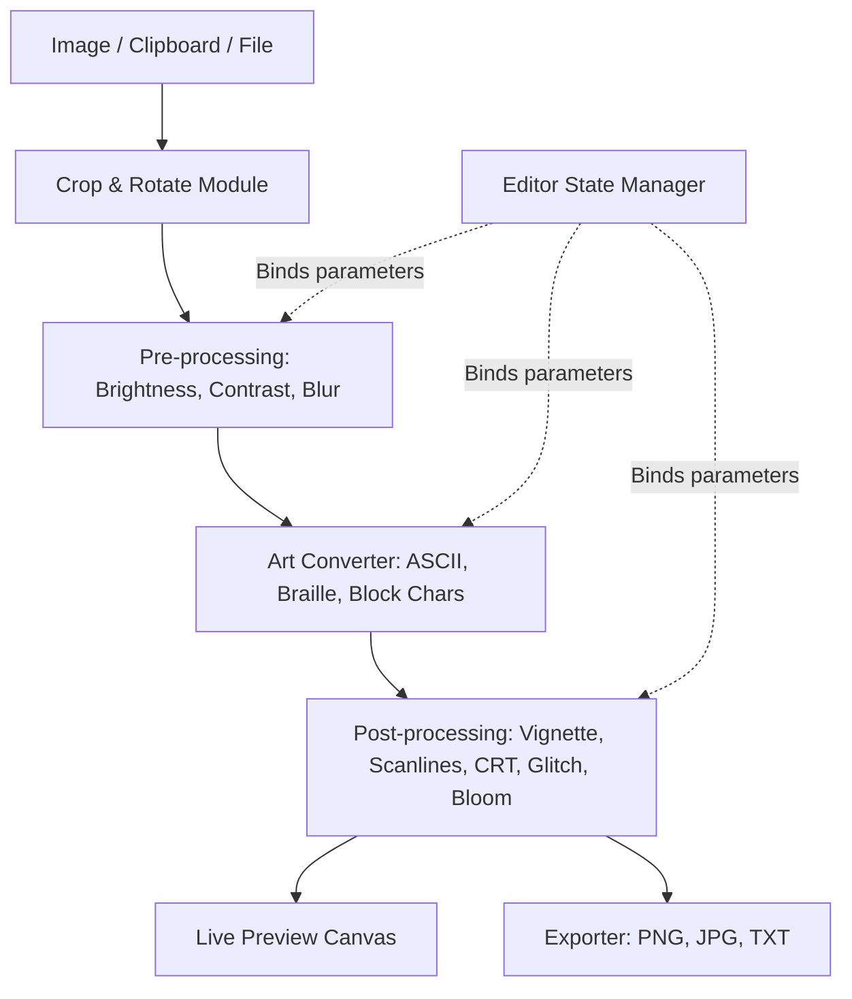

# Design Document - Image to ASCII / ASCII Magic Clone

> **SCOPE UPDATE (2026-07-05): IMAGE-ONLY & RETRO-CYBER THEME.**
> 1. **Image-Only Conversion**: Video upload, video rendering loops, and WebM/MP4/GIF exports are hidden from the UI. The application is locked to "Image to ASCII" still-frame rendering (PNG, JPG, TXT output).
> 2. **Sleek Retro-Cyber Terminal Theme**: The visual identity is transformed from the competitor's flat dark theme into a premium, immersive retro-futuristic hacker terminal with a customized color scheme and screen glow effects.

## Overview

This document outlines the technical design for a complete, production-grade clone of [ASCII Magic](https://www.ascii-magic.com/) optimized for the "image to ascii" keyword.
1. **Landing Page (`index.html`)**: A premium retro-cyber terminal promotional page featuring an interactive before/after ASCII comparison slider, image-only community showcases, and terminal-specific FAQs.
2. **Editor Page (`app/index.html`)**: A streamlined workspace focused on image-to-ASCII conversion, featuring visual panel overlays, retro-themed controllers, and stacked post-processing shader filters.

## Design Concept: Sleek Retro-Cyber Terminal

### Color Palette (Retro-Arcade Console)
- **Primary Background**: Deep space-black (`#0a0a0c`).
- **Core Text & ASCII Output**: Phosphor Green (`#33ff33` / `rgb(51, 255, 51)`).
- **Core CTAs & Key Actions** (e.g. "Open Tool", "Export", "Upload"): Plasma Amber/Orange (`#ff9d00` / `rgb(255, 157, 0)`).
- **Secondary Headings & Accent Borders**: Cyber Cyan (`#00ffff` / `rgb(0, 255, 255)`).
- **Subtle Muted Labels**: Dim Green (`#1b5c1b`).

### Screen Curvature & Scanlines (Overlay Shader)
- A global CSS screen overlay will apply a high-fidelity CRT filter:
  - **Scanlines**: Repetitive SVG or CSS gradient lines layered over the viewport.
  - **CRT Curvature**: A subtle radial gradient vignette simulating a convex phosphor screen.
  - **Typographic Glow**: A text shadow effect (`text-shadow: 0 0 4px rgba(51, 255, 51, 0.45)`) applied to terminal labels and headings.

---

## UI/UX Hiding Strategy (Option B)

### Landing Page (`index.html`) UI Cleanup
1. **Header Navigation**:
   - Hide the "Styles" and "Recipes" navigation links.
2. **Hero Slider**:
   - Hide the style selection pills row (`#pills`) completely. The comparison slider is locked to the "Characters" (ASCII) style.
3. **Showcase Sections**:
   - Hide the "Thirteen art styles, one source" section.
   - Filter out video items from the community track.
   - Remove "Cool Videos" from the use-cases grid.
4. **FAQs**:
   - Hide FAQ entries related to video uploads, formats, and other styles.
5. **Footer**:
   - Remove columns mapping other styles and tools.

### Editor Page (`app/index.html`) UI Cleanup
1. **Sidebar Controllers**:
   - Add `display: none` to:
     - **Dither Engine** panel section (`#dither-section`).
     - **Lights** panel section.
     - **Animation** panel section.
2. **Upload Zone**:
   - Remove references to video files (`.mp4`, `or videos` text).
3. **Style Selection**:
   - Filter the main render style dropdown to only include:
     - **Characters** (ASCII)
     - **Braille** (Unicode dot-art)
     - **Block Chars** (Unicode blocks)
4. **Playback Controls**:
   - Hide the video playback control track beneath the main canvas.
5. **Exporter Options**:
   - Hide GIF, WebM, and MP4 download buttons. Keep only **PNG**, **JPG**, and **TXT** export targets.

---

## Technical Architecture

The application adopts a modular client-side pipeline architecture. The UI is built around a single reactive state model, while the graphics processor executes frame rendering dynamically.

---

## Testing & Verification Strategy

### visual & Console Audit
1. Verify that all 404 console errors are gone after asset mirroring.
2. Verify that CSS rules hiding the targeted options (`dither-section`, `lights-section`, `playback-controls`, video drop-zones) apply cleanly on mobile and desktop layout screens.
3. Verify that the CRT scanlines overlay does not interfere with click/drag events on the slider or panel controls.
